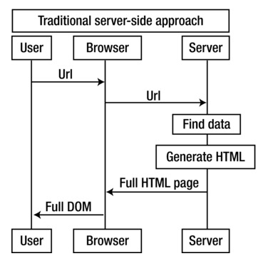
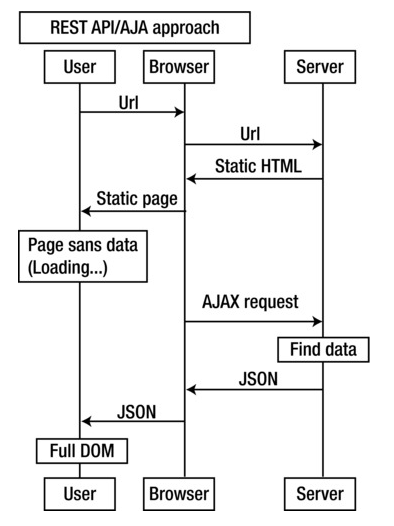

footer: © Node Program, 2016
slidenumbers: true

# Node Program
## Express.js


Node.js version: 7
Last updated: Nov 2016

---

### Express

Express is the most popular web application framework for Node. It is easy to work with as it ties into Node's functional paradigm.

* Deliver static content (or consider using nginx)
* Modularize business logic
* Construct an API
* Connect to various data sources

---

### DEMO

Core http module API: <http://bit.ly/1StXFsG>

:computer: :confused:

---

# With Express you can develop APIs faster!

---

### Express vs. http

* URL params and query strings parsing
* Automatic response headers
* Routes and better code organization
* Myriads of plugins (called middleware)
* Request body parsing (with a module)
* Authentication, validation, session and more! (with modules)


---

### Installing Dependency

```
$ npm install express --save
```

```
$ npm install express@4.13.3 --save
```
---


## Installing Scaffolding

Install Express.js command-line generator:

```
$ npm install -g express-generator
```

---

### Using the Generator

```
$ express todo-list-app
$ cd todo-list-app
$ npm install
$ npm start
```

^Go through all aspects of the generated app and point out various features. Specifically talk about app.js and how it abstracts away some things for testing

---

### Structure

* `app.js`: main file, houses the embedded server and application logic
* `/public`: contains static files to be served by the embedded server
* `/routes`: houses custom routing for the embedded server
* `/views`:  contains templates that can be processed by a template engine

---

* `/package.json`
* `/www`
* `/routes/users.js`

---

## app.js

1. Imports and instantiations
2. Configurations
3. Middleware
4. Routes
5. Bootup

---

## Configuring Express

The Express server needs to be configured before it can start

Manage configuration via the `set` method:

```
var express = require('express')
var app = express()
app.set('port', process.env.PORT || 3000)
app.set('views', 'templates') // The directory the templates are stored in
app.set('view engine', 'jade')
```

---

## Node.js Middleware Pattern

---

### What is Middleware

Middleware pattern is a series of processing units connected together, where the output of one unit is the input for the next one. In Node.js, this often means a series of functions in the form:

```js
function(args, next) {
  // ... Run some code
  next(output) // Error or real output
}
```

---

## Continuity

Request is coming from a client and response is sent back to the client.

```
request->middleware1->middleware2->...middlewareN->route->response
```

---

### Organizing Code

`database` in `app.js`, but we need it in `routes/users.js` where our `/users` routes are located

How to pass the `database` reference? Something like this?

```
var users = require('./routes/users.js')(database)
```

There is a better way!

---

### Connect Framework

Express leverages the Connect framework to provide the middleware functionality. Middleware are used to manage how a request should be handled.

---

### Applying Connect/Express Middleware

Example:

```js
var express = require('express')
var app = express()
//... Define middleware1-N
app.use(middleware1)
app.use(middleware2)
...
app.use(middlewareN)
...
```

---

### Middleware Order

Middleware are executed in the order specified:

```js
var logger = require('morgan')
var bodyParser = require('body-parser')
...
app.use(logger('dev'))
app.use(bodyParser.json())
```


---

### Two Categories of Express Middleware

1. npm modules, e.g., `body-parser`
2. Custom middleware

---

### Creating Middleware

Custom middleware is easy to create with a reference:

```js
var middleware = function (request, response, next) {
  // Modify request or response
  // Execute the callback when done
  next()
}
app.use(middleware)
```

---

### Creating Middleware

Or with anonymous function definition:

```js
app.use(function (request, response, next) {
  // Modify request or response
  // Execute the callback when done
  next()
})
```

---

### Passing References

`request` is **always** the same object in the lifecycle of a single client request to the Experss server

This solves the database reference problem:

```js
app.use(function (request, response, next) {
  request.database = database
  next()
})
```

---

### Most Popular and Useful Connect/Express Middleware

`$ npm install <package_name> --save`

* [body-parser](https://github.com/expressjs/body-parser) request payload
* [compression](https://github.com/expressjs/compression) gzip
* [connect-timeout](https://github.com/expressjs/timeout) set request timeout
* [cookie-parser](https://github.com/expressjs/cookie-parser) Cookies
* [cookie-session](https://github.com/expressjs/cookie-session) Session via Cookies store

---

### Connect/Express Middleware

* [csurf](https://github.com/expressjs/csurf) CSRF
* [errorhandler](https://github.com/expressjs/errorhandler) error handler
* [express-session](https://github.com/expressjs/session) session via in-memory or other store
* [method-override](https://github.com/expressjs/method-override) HTTP method override
* [morgan](https://github.com/expressjs/morgan) server logs
* [response-time](https://github.com/expressjs/response-time)

---

### Connect/Express Middleware

* [serve-favicon](https://github.com/expressjs/serve-favicon) favicon
* [serve-index](https://github.com/expressjs/serve-index)
* [serve-static](https://github.com/expressjs/serve-static) static content
* [vhost](https://github.com/expressjs/vhost)

---

## Other Popular Middleware

* [cookies](https://github.com/jed/cookies) and [keygrip](https://github.com/jed/keygrip): analogous to `cookieParser`
* [raw-body](https://github.com/stream-utils/raw-body)
* [connect-multiparty](https://github.com/superjoe30/connect-multiparty), [connect-busboy](https://github.com/mscdex/connect-busboy)
* [qs](https://github.com/visionmedia/node-querystring): analogous to `query`
* [st](https://github.com/isaacs/st), [connect-static](https://github.com/andrewrk/connect-static) analogous to `staticCache`

---

## Other Popular Middleware

* [express-validator](https://github.com/ctavan/express-validator): validation
* [less](https://github.com/emberfeather/less.js-middleware): LESS CSS
* [passport](https://github.com/jaredhanson/passport): authentication library
* [helmet](https://github.com/evilpacket/helmet): security headers
* [connect-cors](http://github.com/antono/connect-cors): CORS
* [connect-redis](http://github.com/visionmedia/connect-redis)

---

### Template Engine

Setting the `view engine` variable to `jade` for instance, would trigger
the following function call internally

```js
app.set('view engine', 'jade') // Shorthand

// Does the same as the above
app.engine('jade', require('jade').__express)
```

---

### Template Engine

Custom callbacks can be defined to parse templates

```js
app.engine([format], function (path, options, callback) {
  // Template parsing logic goes here
})
```

Note: custom callbacks are useful if the template engine doesn't export an **__express** function

---

### Express Route

```js
app.get('/', function(req, res) {
  res.end()
})
```

---

### Express Bootup

```js
var http = require('http'),
    express = require('express')

var app = express()

// ... Configurations, middleware and routes

var server = http.createServer(app)
server.listen(app.get('port'), function () {
  // Do something... maybe log some info?
})
```

---

### Bootup 2

```js
var http = require('http'),
    express = require('express')

var app = express()

// ... Configurations, middleware and routes

app.listen(app.get('port'), function () {
  // Do something... maybe log some info?
})
```

---

### Launching the App

```
$ node server
$ nodemon server
$ node-dev server
$ forever server
$ pm2 server
```

---

# Express is awesome! :rocket:

---

## Workshop

🔨

```
$ npm i -g expressworks
```

<https://github.com/azat-co/expressworks>

Videos for solutions: [YouTube ExpressWorks Playlist](https://www.youtube.com/watch?v=C2IqQOLCCoU&list=PLguYmmjtxbWGwQRxXqMTQCj6FNb55aFVo)

or <http://bit.ly/1jW1sBf>

---

# Building a RESTful API

---

### Traditional Web App

Also called thick server.



---

### Traditional Web App Problems

* Slow and single-tasked (not multitasking)
* Poor and unresponsive UX (user experience)
* Duplication of data hogs bandwidth (HTML)

---

### API + AJAX/XHR Web App

Also called thick client



---

### Advantages of a Thick Client

* Responsive interface and UX
* Only data is transmitted (JSON)
* Re-use of the core functionality
* Asynchronous tasks
* Real-time apps

---


### Node, SPAs and REST

Build an API once and use everywhere


---


### REST Basics

REpresentational State Transfer (REST) is an architectural pattern for developing network applications

REST systems aim to keep things simple when connecting to and exchanging data between machines

---

### Why HTTP?

HTTP is the ideal protocol for REST, given its stateless nature and client-server architecture

* REST is far simpler compared to Remote Procedure Calls (RPC) and Web Services (SOAP, UDDI, etc)
* RPCs and Web services rely on complex vocabularies for communication
* Each new operation is a new vocabulary entry, increasing code complexity

---

### REST Verbs

REST uses HTTP requests (and verbs) for CRUD operations

* GET
* PUT
* POST
* DELETE

---

### REST Verbs

And sometimes...

* PATCH
* HEAD
* OPTIONS

---

### Common Endpoints

```
GET    /tickets     - Retrieve a list of tickets
GET    /tickets/12  - Retrieve a specific ticket
POST   /tickets     - Create a new ticket
PUT    /tickets/12  - Update ticket #12
DELETE /tickets/12  - Delete ticket #12
PATCH   /tickets/12  - Partially update ticket #12
OPTIONS /tickets/12  - What can I do to ticket #12?
HEAD    /tickets/12  - What headers would I get if I tried to get ticket #12?
```

---

### Handlers Signatures

* `function(request, response, next) {}`: request handler signature
* `function(error, request, response, next) {}`: *error* handler signature

---

### HTTP Verbs and Routes

* `app.get(urlPattern, requestHandler[, requestHandler2, ...])`
* `app.post(urlPattern, requestHandler[, requestHandler2, ...])`
* `app.put(urlPattern, requestHandler[, requestHandler2, ...])`
* `app.delete(urlPattern, requestHandler[, requestHandler2, ...])`

---

### HTTP Verbs and Routes

* `app.all(urlPattern,  requestHandler[, requestHandler2, ...])`
* `app.param([name,] callback)`:
* `app.use([urlPattern,] requestHandler[, requestHandler2, ...])`

---

### Request

* `request.params`: parameters middlware
* `request.param`: extract one parameter
* `request.query`: extract query string parameter
* `request.route`: return route string

---

### Request

* `request.cookies`: cookies, requires cookieParser
* `request.signedCookies`: signed cookies, requires `cookie-parser`
* `request.body`: payload, requires `body-parser`

---

### Request Header Shortcuts

* `request.get(headerKey)`: value for the header key
* `request.accepts(type)`: checks if the type is accepted
* `request.acceptsLanguage(language)`: checks language
* `request.acceptsCharset(charset)`: checks charset
* `request.is(type)`: checks the type
* `request.ip`: IP address

^These shortcuts a.k.a. sugarcoating

---

### Request Header Shortcuts

* `request.ips`: IP addresses (with trust-proxy on)
* `request.path`: URL path
* `request.host`: host without port number
* `request.fresh`: checks freshness
* `request.stale`: checks staleness
* `request.xhr`: true for AJAX-y requests

---

### Request Header Shortcuts

* `request.protocol`: returns HTTP protocol
* `request.secure`: checks if protocol is `https`
* `request.subdomains`: array of subdomains
* `request.originalUrl`: original URL

---

### HTTP Responses

The response object is also accessible via routing handlers in Express

It is the second argument in the handler's callback

```js
app.get('/users/:id', function (request, response) {
  // 'response' is the enhanced response from http
})
```

The response object can be used to modify an HTTP response before sending it out

---

### Express Response Method

* `response.redirect(url)`: redirect request
* `response.send(data)`: send response
* `response.json(data):` send JSON and force proper headers

---

### Express Response Method

* `response.sendfile(path, options, callback)`: send a file
* `response.render(templateName, locals, callback)`: render a template
* `response.locals`: pass data to template

---

### HTTP Status Codes

To specify a status code, use the response object's **status** function

```js
app.get('/user/:id', function (request, response) {
  // Logic to check for user
  if (!exists) {
    response.status(404)
  } else if (authorized) {
    response.status(200)
  } else {
    response.status(401)
  }
  // ...
})
```

---

### HTTP Status Codes

* 2XX: for successfully processed requests
* 3XX: for redirections or cache information
* 4XX: for client-side errors
* 5XX: for server-side errors

Note: for 3xx status codes, the client must take additional action following the completion of the current request

---


### Sending a Response

Use the response object's **send** function to send the client a response

```js
app.get('...', function (request, response) {
  response.send('Hello World!')
})
```

---

### Sending a Response

The content-type is determined given the type of argument passed

```js
response.send('Hello World!')       // Content-type: text/plain
response.send([ 5, 7, 9 ])          // Content-type: application/json
response.send({ name: 'John Doe' }) // Content-type: application/json
```

---

### Sending a Response

The content-type can also be hardcoded

```js
response.set('Content-Type', 'text/plain')
response.send('Just regular text, no html expected!')
```

---

### Sending an Empty Response

```js
response.status(404).end()
```

---


### Request Body

Enable the `json()` and `urlencoded()` middleware to convert raw form data into JSON

```
$ npm install body-parser --save
```

---

### Parsing Request Body

Import middleware:

```js
var bodyParser = require('body-parser')
```

Parse `application/json`

```js
app.use(bodyParser.json())
```

Usage: single-page applications and other JSON REST clients.

---

### Parsing Request Body

Parse `application/x-www-form-urlencoded`

```js
app.use(bodyParser.urlencoded({extended: false}))
```

Usage: web forms with `action` attribute.

^Extended false is querystring and true is qs. The "extended" syntax allows for rich objects and arrays to be encoded into the URL-encoded format, allowing for a JSON-like experience with URL-encoded

---


### Sessions

HTTP is a stateless protocol - information about a client is not retained over subsequent requests

Use sessions to overcome this problem

Enable the `cookieParser` and `session` middleware to process cookies

---

### Sessions

```js
app.use(express.cookiesParser())
app.use(express.session({ secret: 'notastrongsecret' }))
```

The session is now accessible via `request.session`

```js
app.get('...', function (request, response) {
  var session = request.session
})
```

---

### Redis Store with Express

```
$ npm install connect-redis express-session
```

```js
var session = require('express-session'),
  RedisStore = require('connect-redis')(session)

app.use(session({
  store: new RedisStore(options),
  secret: 'keyboard cat'
}))
```

---

### Node in Production

* Docker: FROM argon
* Clusters: pm2, slc, nodemon
* Nginx, HAProxy, Varnish

---

### Cloud

* FaaS: AWS Lambdas and API Gateways, Azure Functions
* IaaS: use Linux package managers to install Docker, Git, Node
* PaaS: Azur App Services, Heroku mostly use Git and `package.json`

For more info on Node in production follow [Node.University](http://node.university)

---

### Alternatives

* Sails
* LoopBack :point_left:
* Meteor
* Hapi
* Restify

---

### More Alternatives

Registry of hand-picked Node frameworks: [nodeframework.com](http://nodeframework.com)

---


## REST API Example

Code along side!

Goal: build RESTful API with MongoDB

---

# Message Board API

* `POST /messages`
* `GET /messages`

---

### App

Create `index.js` and start implementing the server.

---

```js
var express = require('express'),
  mongodb = require('mongodb'),
  app = express(),
  bodyParser = require('body-parser'),
  validator = require('express-validator'),
  logger = require('morgan'),
  errorHandler = require('errorhandler'),
  compression = require('compression'),
  url = 'mongodb://localhost:27017/board'
```

---

```js
mongodb.MongoClient.connect(url, function(err, db) {
  if (err) {
    console.error(err)
    process.exit(1)
  }
```

---

```js
app.use(compression())
app.use(logger('combined'))
app.use(errorHandler())
app.use(bodyParser.urlencoded({extended: true}))
app.use(bodyParser.json())
app.use(validator())
app.use(express.static('public'))
```

---

```js
app.use(function(req, res, next){
    req.messages = db.collection('messages')
    return next()
  })
```

---

### GET Route

```js
app.get('/messages', function(req, res, next) {
  req.messages.find({}, {sort: {_id: -1}}).toArray(function(err, docs){
    if (err) return next(err)
    return res.json(docs)
  })
})
```

---

```js
app.post('/messages', function(req, res, next){
  console.log(req.body)
  req.checkBody('message', 'Invalid message in body').notEmpty()
  req.checkBody('name', 'Invalid name in body').notEmpty()
  var errors = req.validationErrors()
```

---

```js
if (errors) return next(errors)
 req.messages.insert(req.body, function (err, result) {
   if (err) return next(err)
   return res.json(result.ops[0])
 })
})
```

---

```js
app.get('*', function(req, res, next){
  res.send('Server provides two endpoints GET\
    /messages and POST /messages.\n Use Postman, curl or\
    another client to make HTTP requests.')
})
```

---

```js
app.listen(3000)
})
```

---


## Run it!

Test with CURL or Postman

```
curl localhost:3000/messages
curl -H "Content-Type: application/json" -X POST -d '{"message":"hi","name":"Bob"}' localhost:3000/messapes
```

---


### Accessing URL Parameters

A URI segment can be parameterized by prefixing it with a semi-colon

```js
app.get('/users/:id', function (request, response) {
  request.params.id
})
```

`GET /users/572611d856b11dcec61651bb`

---

### Multiple URL Parameters

GET /users/:id/:some/:filter

```
request.params.id
request.params.some
request.params.filter
```

---

### PUT

To update a resource (or create if it doesn't exist, perhaps)...

```js
app.put('/users/:id', function (request, response) {
  var id = request.params.id
  // Check if the user exists
  ...
  if (exists) {
    // Code to modify the user
  } else {
    // Code to create the user
  }
  response.send(user)
})
```

---

### DELETE

To delete a resource, create a DELETE handler for the desired URI

```js
app.delete('/users/:id', function (request, response) {
  var id = request.params.id
  // code to delete the user
  response.send(user) // or maybe the URL to create a new user?
})
```

Note: `del` is [deprecated](https://github.com/jspears/mers/issues/33).


---


# Project Time!

💻 :grin:


---


### Questions and Exercises

❓🙋:+1:


---

## Workshop

1. Create a new folder
1. Connect to MongoDB in Express
2. GET and POST for `/messages`
3. PUT and DELETE for `/messages`

Example: `code/node/board-express`