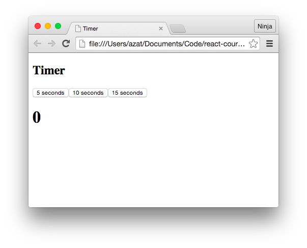

footer: © Node Program, 2016
slidenumbers: true

# Node Program
## Lesson 1: React Basics


React.js version: 0.14.3
Last updated: Feb 2016

---

# Quick Intro

---

### The Definition

What is React.js?

> It’s not about templates, or data binding, or DOM manipulation. It’s about using functional programming with a virtual DOM representation to build ambitious, high-performance apps with JavaScript.

Pete Hunt <http://bit.ly/1U53Rb2>

---

### Key Differences

* Virtual DOM
* Declarative (not imperative)
* Functional
* No DOM manipulation
* No templates
* No event listeners or handlers

---

### MVC

React.js is not a model-view-controller (MVC) framework/library.

---

# You need to bring your own models and routers.


---

# React.js is only VIEW.


---

### Web Stack

## React.js can work with other MVC-like framework such as Backbone.js and Angular.js.

---


## React.js is often used with Flux and Meteor.

---

# Hello World

---

### Downloading React.js

There are several ways:

1. Source code for this course.
1. React.js website: <http://facebook.github.io/react/downloads.html>.
1. nmp: `$ npm install react react-dom`.

---

# npm

```
$ mkdir react-project
$ cd react-project
$ npm init
```

```
$ npm i --save react@0.14.7 react-dom@0.14.7
```

---

`react-project/node_modules/react/dist/react.js`
`react-project/node_modules/react-dom/dist/react-dom.js`

---

### Creating HTML

Start the HTML file `hello-world.html`:

```html
<!DOCTYPE html>
<html>
```
---

### React.js Inclusion

Include React.js and React DOM libraries:

```html
  <head>
    <script src="react.js"></script>
    <script src="react-dom.js"></script>
  </head>
```

If you downloaded the react-0.14.3, then this file will be in the build folder.
You can choose minified version (react.min.js) as well.

---

```html
  <head>
    <script src="node_modules/react/dist/react.js"></script>
    <script src="node_modules/react-dom/dist/react-dom.js"></script>
  </head>
```

---

### React.js CDN

Or hotlink to Facebook CDN:

```html
<script src="https://fb.me/react-0.14.7.min.js"></script>
<script src="https://fb.me/react-dom-0.14.7.min.js"></script>
```

---

### HTML Structure

The `div` in the body of `hello-world.html`:

```html
  <body>
    <div id="example"></div>
    <script type="text/javascript">
    ... // React.js code
    </script>
  </body>
</html>
```

---

### H1 Element

The following snippet creates the h1 React.js object with content 'Hello world!':

```js
React.createElement('h1', null, 'Hello world!')
```

---

### Rendering

Once the element is created we render it to the DOM element with ID example and renders it:

```js
ReactDOM.render(React.createElement('h1', null, 'Hello world!'),
  document.getElementById('example')
);

```

---

### Running The Page

Open `hello-world.html` and check if you see Hello world!


---

### Inspecting HTML

If we inspect the HTML generated by React.js, it will have this attribute:

```html
<h1 data-reactid=".0">Hello world!</h1>
```

---

### HTML Arguments

Virtually all HTML arguments are supported so you can pass them like this:

```js
React.createElement("div", {style: "color:red"}, "Hello ", "world!")
```

Note: You can add many parameters at the end to combine them.

---

### for and class Attributes

If you need to use `for` or `class` attributes, their names are `forHtml` and `className`. For example,

```js
React.createElement("div", {className: "hide"}, "Hello world!")
```

---

# Meet JSX

---

### What is JSX

JSX is a combination of JavaScript and XML. HTML is a form of XML:

```js
ReactDOM.render(
  <h1>Hello world!</h1>,
  document.getElementById('example')
);
```

---

### What is JSX (Cont.)

JSX is compiled into native/regular JavaScript. JSX allows for easier and faster writing HTML views and elements along with JavaScript

<https://jsx.github.io/>

---

### Why Use JSX

The mix of XML and JS looks weird, but its the recommended way of writing React.js apps because it provides syntax for components, layouts and hierarchy.

Note: As you've seen from the previous Hello World! example, JSX is optional.

---

### Ways to use JSX

1. Pre-process with `babel-cli`: production recommended
1. Build with Gulp, Grunt, Webpack and Babel: production recommended
1. Run-time via `babel-standlone` v6.4.4: development only

---

### Run-time JSX

Run-time JSX performed by `babel-standlone` v6.4.4 file (Babel v5.x had `browser.js`).

Download <https://cdnjs.cloudflare.com/ajax/libs/babel-standalone/6.4.4/babel.min.js>

---


### Babel Standalone

For now, we'll use the Babel Standalone v6.4.4. This code goes into `hello-world-jsx.html`:

```html
<script src="https://cdnjs.cloudflare.com/ajax/libs/babel-standalone/6.4.4/babel.min.js"></script>
```

---

### JSX Type Script

Let's convert the code from JavaScript to JSX by changing `text/javascript` to `text/babel`:

```html
  <body>
    <div id="example"></div>
    <script type="text/babel">
    ...
    </script>
  </body>
</html>
```

---

### JSX Code

Change `React.createElement` to `<h1>...</h1>`:

```js
ReactDOM.render(
  <h1>Hello world!</h1>,
  document.getElementById('example')
);
```

---

### Running the Code

Open `hello-world-jsx.html` and check if you see Hello world!


---

# Babel

The JavaScript compiler.

<http://babeljs.io/>

---

### Compiling JSX with Babel

For more realistic and production-like example, we'll use Babel. This will allow us to compile JSX into native JS and run only native JS in the browser. This will increase performance in production React.js apps.

---

### What is Babel

Babel allows you to use ECMAScript 6 now by compiling ES6 code into ES5-friendly code to support browsers that don't have ES6 yet.

<https://babeljs.io/>

---

### Separation of Concerns

Firstly, let's abstract JSX code from `hello-world-jsx.html` HTML into two files:

1. `hello-world.jsx`
1. `hello-world-jsx-babel.html`

Note: The native JavaScript example can also be split into two files.

---

### Code Inclusion

Add this line to the `hello-world-jsx-babel.html` file **right before** closing `body`:

```html
...
    <script src="hello-world.js"></script>
...
```

---

### Pre-processed JSX

Pre-processing JSX is better over run-time because it's faster. Pre-processing is the same as compiling into native JavaScript. You can do it with Babel CLI

---

### Babel CLI

```
$ npm install --save-dev babel-cli@6.4.4 babel-preset-react@6.4.4
$ echo '{ "presets": ["react"] }' > .babelrc
$ ./node_modules/.bin/babel src -d lib
```

---

```
$ ./node_modules/.bin/babel hello-world.jsx -o hello-world.js -w
```

The `hello-world.js` will be created. Leave Babel running so the `-w` can update changes automatically.

---


### Compiling with Babel

Compile JSX into regular JS with:

`$ babel -w hello-world-component.jsx -o hello-world-component.js`

---

### Running the Code

Open `hello-world-jsx-babel.html` and check if you see Hello world!


---

### Auto Update

Each time you change `hello-world.jsx`, the tool should update `hello-world.js` with the message:

```
change hello-world.jsx
```

---


# Composable Components

The concept of components is the foundation of React.js philosophy. They allow you to reuse code and logic. They are like templates only better.

---

### Types of React.js Components

React.js component types:

* Regular HTML elements such as h1, p, div, etc.
* Custom or composable components

---

### Difference Between Regular and Custom Components

If it's a regular HTML tag name, then React.js will create such element. Otherwise, it will look for the custom component definition.

Note: React.js uses lower-case vs. upper case to distinguish between HTML tags and components.

---

### Defining a Component

Composable components are created with `React.createClass` and must have `render` method that returns regular component (div, h1, etc.):

```js
var HelloWorld = React.createClass({
  render: function() {
    return <h1>Hello world!</h1>
  }
})
```

---

### Refactoring with a HelloWorld Component

The `hello-world-component.jsx` file has a custom component:

```js
var HelloWorld = React.createClass({
  render: function() {
    return (
      <h1>Hello world!!!</h1>
    )
  }
})

ReactDOM.render(
  <HelloWorld/>,
  document.getElementById('example')
)
```

---


### HTML Skeleton

Point your `hello-world-component.html` to use `hello-world-component.js`, not `hello-world-component.jsx`:

```html
<!DOCTYPE html>
<html>
  <head>
    <script src="react.js"></script>
  </head>
  <body>
    <div id="example"></div>
    <script src="hello-world-component.js"></script>
  </body>
</html>
```

---


### Running the Code


Open `hello-world-component.html` and check if you see Hello world!


---

### Auto Update

Each time you change `hello-world-component.jsx`, the tool should update `hello-world.js` with the message:

```
change hello-world.jsx
```

---

# Nested Elements

Nesting React.js components is easy.

---


### Rendering Title and Text

This is how we can nest `h1` and `p` inside of `div`:

```js
ReactDOM.render(
  <div>
    <h1>
      Core React.js
    </h1>
    <p>This text is very useful for learning React.js.</p>
  </div>,
  document.getElementById('example')
)
```

---

### Single Top-Level Tag

Remember to always have only one element as the top level tag!
For example, this is a **no go**:

```js
ReactDOM.render(  
  <h1>
    Core React.js
  </h1>
  <p>This text is very useful for learning React.js.</p>
  ,
  document.getElementById('content')
)
```

---

Obviously, we can create nested structures in custom components:

```js
var Content = React.createClass({
  render: function() {
    return (
      <div>
        <h1>
          Core React.js
        </h1>
        <p>This text is very useful for learning React.js.</p>
      </div>
    )
  }
})
```

---

```js
ReactDOM.render(
  <Content />,
  document.getElementById('content')
)
```

---

### Running the Code

Open `content.html` and check if you see title and text!


---

### Order of the Code

Remember that the content element (`<div id="content"></div>`) must precede the React.js code (`<script ...`), for the `getElementById` method to locate the proper DOM element:

```html
...
    <div id="content"></div>
    <script type="text/jsx">
      var Content = React.createClass({
      ...
      })
      ReactDOM.render(
        <Content />,
        document.getElementById('content')
      )
    </script>
...
```

---

# Variables

Use `{}` to render variable inside of JSX:

```js
{a}
{' '}
{b}
```

---

### Variable Example

In the `variable/script.jsx` file, we output the value of `a`:

```js
var Content = React.createClass({
  render: function() {
    var a = 1
    return (
      <div>
        <h1>
          {a}. Core React.js
        </h1>
        <p>This text is very useful for learning React.js.</p>
      </div>
    )
  }
})
```

---

### Variable Demo

Plnkr allows to edit, run and preview code in the browser.

Variable example: <http://plnkr.co/edit/Aknl72p6aXP71cYLeinj?p=preview>

---

# States

States are mutable properties of components meaning they can change. When state changes the corresponding view changes, but everything else in DOM remains intact.

---

### Initial State

The initial state is set by the `getInitialState` method which is called once when the element is created.

Let's use this method to return `a`:

```js
var Content = React.createClass({
  getInitialState: function(){
    return {a: 0}
  },
  ...
```

---

### Updating State

State is updated with `this.setState`, so this code will update the value with a random number every 300 milliseconds:

```js
var Content = React.createClass({
  getInitialState: function(){
    var _this = this
    setInterval(function(){
      _this.setState({a: Math.random()})
    }, 300)
    return {a: 0}
  },
  ...
```

---

### Outputting The State

To output the state property `a`, we use `{this.state.a}`:

```js
  render: function() {
    return (
      <div>
        <h1>Changing the State</h1>
        <p>This value is random: {this.state.a}</p>
      </div>
    )
  }
})
```

---

### Rendering

The rendering didn't change:

```js
ReactDOM.render(
  <Content />,
  document.getElementById('content')
);
```

<http://plnkr.co/edit/zwpbx50Rddv01bO4eHgW?p=preview>

---

# Component Methods

---


### Calling Methods

It's possible to invoke components methods from the `{}` interpolation:

```js
var Content = React.createClass({
  getA: function(){
    return 10
  },
  render: function() {
    return (
      <div>
        <p>This value is return by the method: {this.getA()} </p>
      </div>
    )
  }
})
...
```

<http://plnkr.co/edit/UmgFDUHCQfuGLJ8MvSbM?p=preview>

---

# Component Events

---

### Events

Components have normalized (cross-browser) events such as

```
onClick onContextMenu onDoubleClick onDrag onDragEnd onDragEnter onDragExit
onDragLeave onDragOver onDragStart onDrop onMouseDown onMouseEnter onMouseLeave
onMouseMove onMouseOut onMouseOver onMouseUp
```

---

### Declaring Events

React.js is declarative, not imperative. So we won't attach event like we would do with jQuery, instead we declare them in the JSX and classes:

```js
var Content = React.createClass({
  getInitialState: function(){
    return {counter: 0}
  },
  click: function(e){
    this.setState({counter: ++this.state.counter})
  },
  ...
```

---

### Button onClick Event

The button has the `onClick={this.click}`.


---

The name must match the method of the `Content` component class:

```js
...
  render: function() {
    return (
      <div>
        <button onClick={this.click}>Don't click me {this.state.counter} times!</button>
      </div>
    )
  }
})
```

---

# Demo

<http://plnkr.co/edit/sIFuS7ng6GKT45t4FvFR?p=preview>


---

# Props

Props or properties are immutable meaning they don't change. They are passed by parent components to their children.

---

### Using Props

```js
var ClickCounterButton = React.createClass({
  render: function() {
    return <button onClick={this.props.handler}>Don't click me {this.props.counter} times! </button>
  }
})
```

---

### Supplying Props

Provide props to the ClickCounterButton component:

```js
var Content = React.createClass({
  getInitialState: function(){
    return {counter: 0}
  },
  click: function(e){
    this.setState({counter: ++this.state.counter})
  },
  render: function() {
    return (
      <div>
        <ClickCounterButton counter={this.state.counter} handler={this.click}/>
      </div>
    )
  }
})
...
```

<http://plnkr.co/edit/0AKIkhI2Nc9btW0TWxHW?p=preview>


---

### Where to Put logic

In this example, click event handler was in the parent element. You can put the event handler on the child itself, but using parent allows you to exchange info between children components.

Let's have a button:

```js
var ClickCounterButton = React.createClass({
  render: function() {
    return <button onClick={this.props.handler}>Don't click me! </button>
  }
})
```

---

### Exchanging Props Between Children

This is a new component which displays value prop:

```js
var Counter = React.createClass({
  render: function(){
    return <span>Clicked {this.props.value} times.</span>
  }
})
```


---

### Parent Component

The parent component provides props one of which is a handler:

```js
var Content = React.createClass({
  getInitialState: function(){
    return {counter: 0}
  },
  click: function(e){
    this.setState({counter: ++this.state.counter})
  },
  render: function() {
    return (
      <div>
        <ClickCounterButton handler={this.click}/>
        <br/>
        <Counter value={this.state.counter}/>
      </div>
    )
  }
})
```

<http://plnkr.co/edit/aCC0paSrd4ABKS2v1Blx?p=preview>

---

### componentDidMount

The `componentDidMount` method is invoked when component is inserted into the DOM. You can use this method to perform operations, and/or send AJAX/XHR requests.

---

### componentDidMount Example

Print DOM:

```js
var Content = React.createClass({
  componentDidMount: function(e){
    console.log(ReactDOM.findDOMNode(this))
  },
  render: function() {
    return (
      <div/>
    )
  }
})
```

The `/did-mount` folder.

---

# Summary

---

### Summary

* You don't need JSX to work with React.js, but its the recommended syntax for React.js components. JSXTransformer for run-time JSX (development only).
* React.js can be installed via multiple sources: npm, website, and CDN.
* JSX type is `text/jsx`: `<script type="text/jsx">`

---

### Summary (Cont.)

* You create React.js elements with `<...>` or `React.createElement` and render them with `ReactDOM.render`
* States are mutable, and props are immutable
* Using Babel can watch for file changes with `-w` flag
* Regular vs. custom components: lower-case first letter

---

### Summary (Cont.)

* `React.createClass` allows to create custom components
* `React.createClass` needs `render` method that return other React.js component (always one).

---

### Summary (Cont.)

* for and class are forHtml and className attributes in React.js components
* `{}` is a way to render variables and JS in the JSX code
* `this.state.NAME` and `this.props.NAME` are ways to access state and props variables respectively

---

### Project: Timer



---

# Timer Demo

---

# Project: Timer Solution

<http://bit.ly/1StYTnF>

---

## Questions and Exercises

😕❓➡️😸
